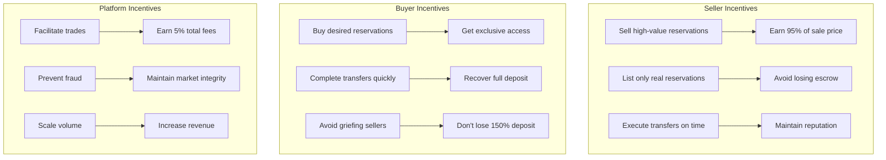
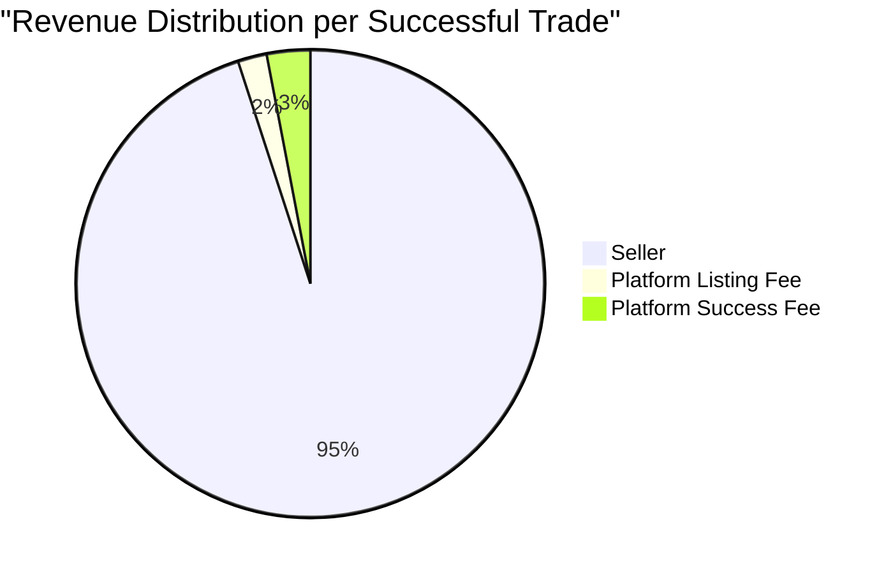
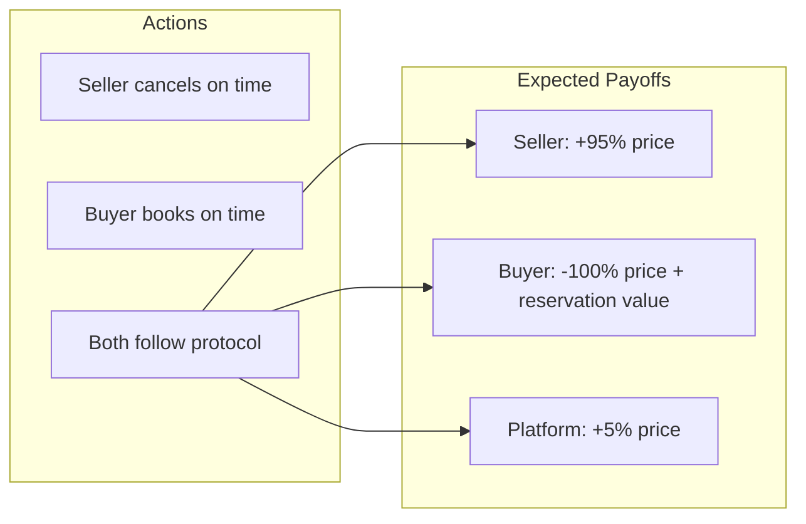
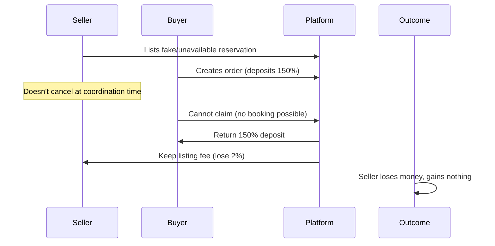
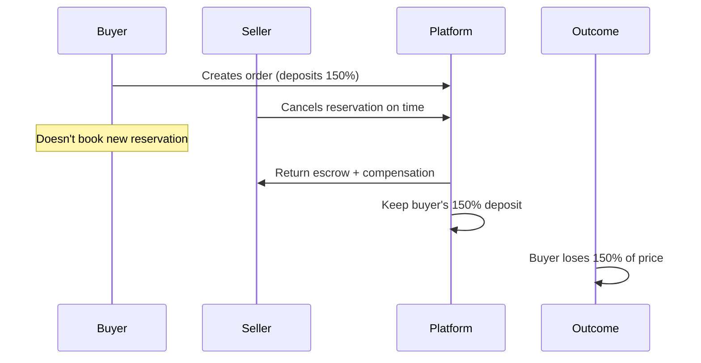
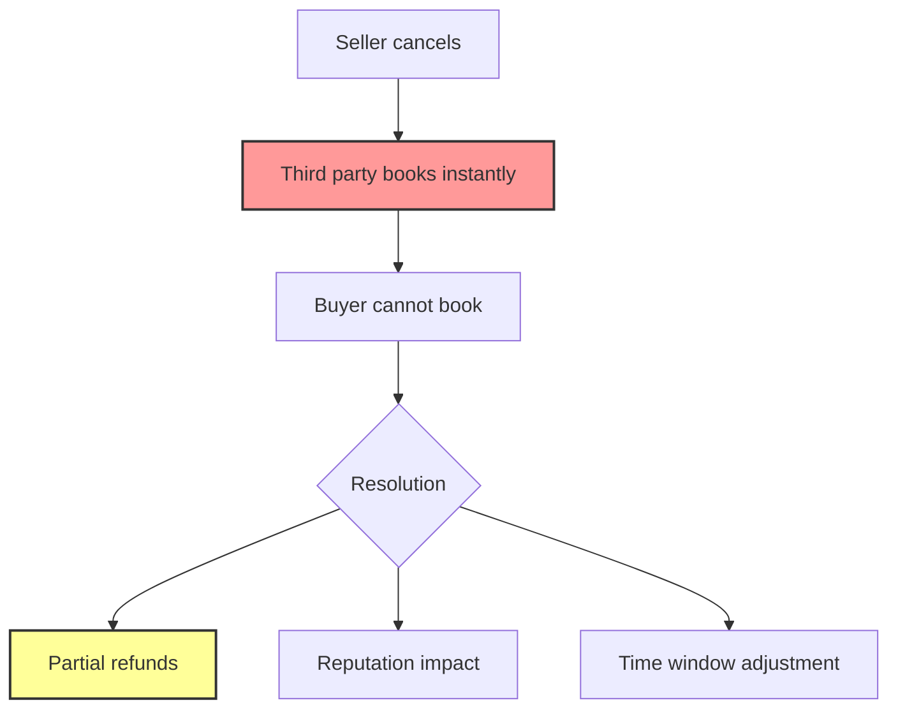
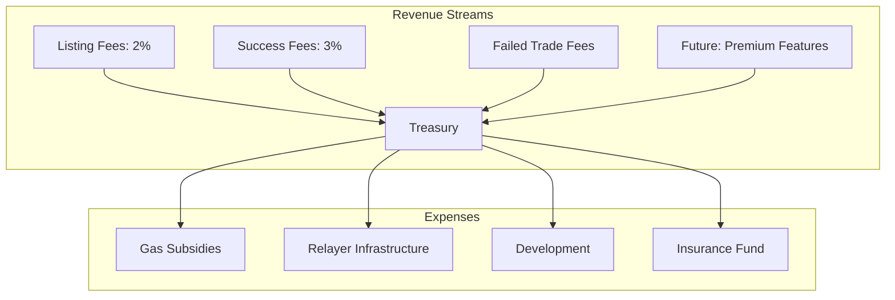
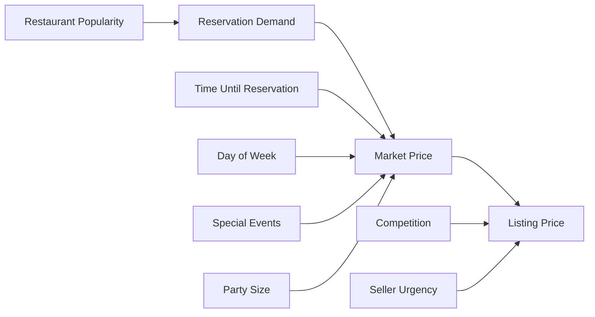
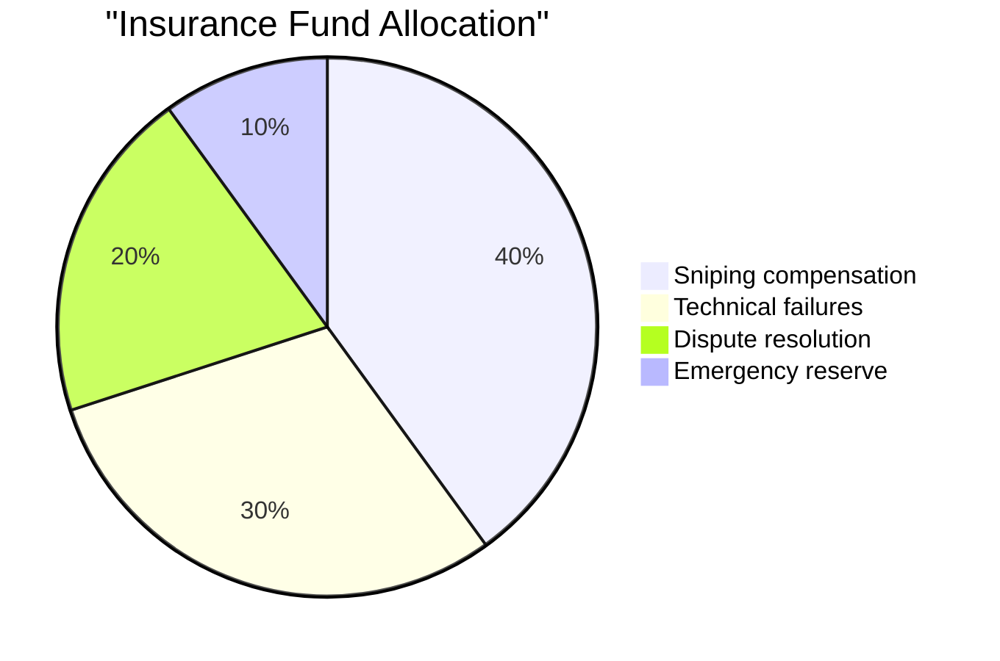
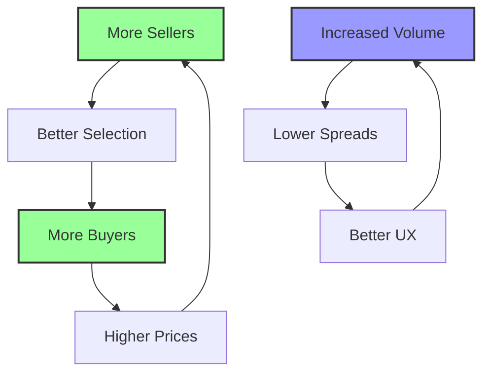

# Economic Model & Game Theory

## Overview

Relay's economic model is designed to incentivize honest behavior while making dishonest actions unprofitable. The system uses a combination of deposits, fees, and time constraints to create a secure marketplace.

## Stakeholder Incentives

## Fee Structure Analysis

### Revenue Distribution

### Deposit Requirements

| Party | Deposit Amount | Purpose | Return Conditions |
|-------|----------------|---------|-------------------|
| Seller | 100% of price | Guarantee delivery | Successful transfer or buyer default |
| Buyer | 150% of price | Prevent griefing | Successful claim or seller default |

## Game Theory Analysis

### Normal Trade Scenario

### Attack Scenarios

#### 1. Seller Doesn't Cancel (Scam Attempt)

**Result**: Seller loses 2% listing fee, gains nothing

#### 2. Buyer Griefing (Waste Seller's Time)

**Result**: Buyer loses 150% deposit, seller compensated

#### 3. Reservation Sniping

**Mitigation**: 
- 30-second coordination window
- Reputation tracking
- Potential insurance fund

## Economic Sustainability

### Platform Revenue Model

### Volume Projections

| Metric | Conservative | Base Case | Optimistic |
|--------|--------------|-----------|------------|
| Monthly Trades | 100 | 500 | 2,000 |
| Average Price | $200 | $300 | $500 |
| Monthly GMV | $20,000 | $150,000 | $1,000,000 |
| Platform Revenue | $1,000 | $7,500 | $50,000 |

## Market Dynamics

### Price Discovery

### Liquidity Incentives

1. **Early Adopter Rewards**
   - Reduced fees for first 1,000 trades
   - Reputation bonuses

2. **Market Maker Program**
   - Lower fees for high-volume traders
   - API access for automated trading

3. **Restaurant Partnerships**
   - Revenue sharing with restaurants
   - Official integration possibilities

## Risk Management

### Economic Risks

| Risk | Impact | Mitigation |
|------|--------|------------|
| Low liquidity | High spreads | Incentive programs |
| Price manipulation | Market distortion | Volume limits |
| Sybil attacks | Fake listings | Stake requirements |
| Gas price spikes | Reduced activity | L2 deployment |

### Insurance Fund

## Behavioral Economics

### Psychological Factors

1. **Loss Aversion**: 150% deposit makes buyers careful
2. **Commitment Device**: Listing fee commits sellers
3. **Time Pressure**: 5-minute claim window drives action
4. **Reputation Value**: Long-term benefits outweigh short-term gains

### Network Effects

## Future Economic Features

### 1. Dynamic Pricing
- Algorithmic fee adjustment based on success rates
- Time-based pricing (peak hours = higher fees)
- Volume discounts

### 2. Staking Mechanism
- Stake tokens for reduced fees
- Stake to become preferred relayer
- Governance participation

### 3. Secondary Markets
- Options on future reservations
- Reservation futures contracts
- Bundled reservation packages

## Conclusion

The Relay economic model creates a sustainable marketplace by:
- Aligning incentives for honest behavior
- Making dishonest actions unprofitable
- Generating platform revenue for growth
- Building network effects for liquidity

The game theory ensures that cooperation is the dominant strategy for all participants. 