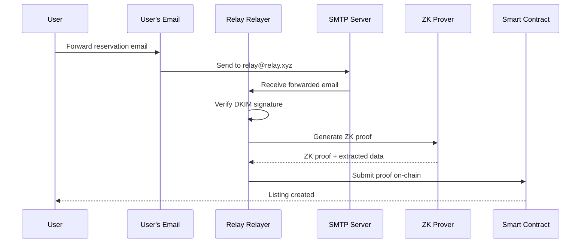
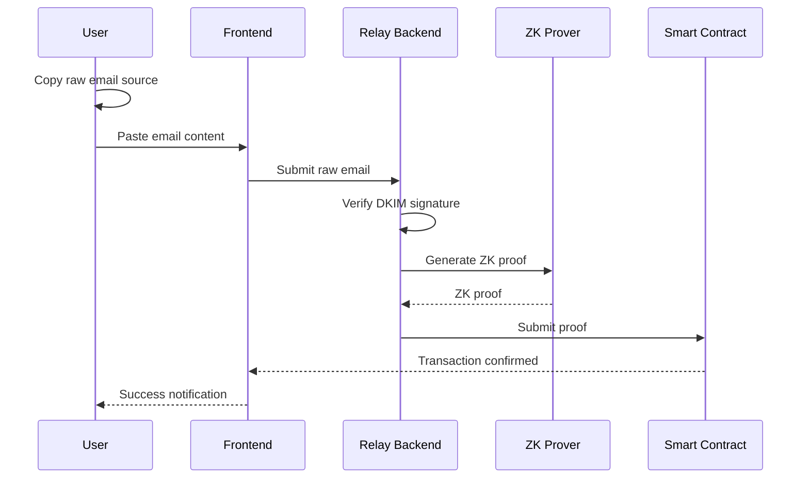
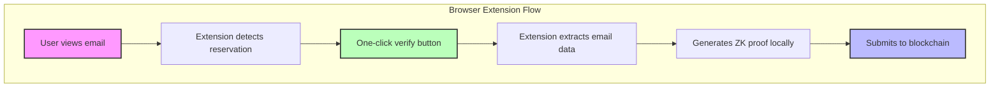

# Email Verification Flows

## Overview

Relay supports multiple methods for users to verify their restaurant reservations through ZK Email proofs. The primary method is forwarding emails to our relayer service, but we also support alternative flows for different user preferences.

## Primary Flow: Email Forwarding



### How It Works

1. **User receives reservation confirmation** from OpenTable/Resy
2. **User forwards the email** to our relayer address (e.g., `verify@relay.xyz`)
3. **Relayer processes the email**:
   - Verifies DKIM signature
   - Extracts reservation details
   - Generates ZK proof
4. **Smart contract verification** happens automatically
5. **User gets confirmation** via email or in-app notification

### Email Subject Commands

Users can include commands in the forward subject:

```
// To list a reservation
Subject: LIST $200

// To cancel and transfer
Subject: CANCEL ORDER_ID

// To claim a new booking
Subject: CLAIM ORDER_ID
```

## Alternative Flow: Copy/Paste Raw Email



### How to Get Raw Email

#### Gmail
1. Open the email
2. Click three dots menu → "Show original"
3. Copy entire content

#### Outlook
1. Open the email  
2. File → Properties → Internet headers
3. Copy full message source

#### Apple Mail
1. View → Message → Raw Source
2. Copy entire content

## Future: Browser Extension



### Benefits
- Seamless user experience
- No email forwarding needed
- Instant verification
- Privacy preserved (proof generated locally)

## Privacy Considerations

### What's Hidden
- Sender's email address
- Full email content
- Personal information

### What's Revealed (in ZK proof)
- Reservation confirmation number
- Restaurant name
- Date/time
- Party size
- Platform (OpenTable/Resy)

## Email Format Requirements

For successful verification, emails must:

1. **Have valid DKIM signature** from supported domains:
   - `opentable.com`
   - `resy.com`
   - Additional platforms coming soon

2. **Contain standard reservation fields**:
   - Confirmation/reservation number
   - Restaurant name
   - Date and time
   - Party size

3. **Be recent** (within 30 days for security)

## Supported Platforms

### Currently Supported
- ✅ OpenTable
- ✅ Resy

### Coming Soon
- ⏳ Tock
- ⏳ Yelp Reservations
- ⏳ SevenRooms

## Technical Details

### DKIM Verification
- Ensures email authenticity
- Prevents forgery
- Cryptographically secure

### ZK Proof Generation
- Hides sensitive information
- Proves ownership without revealing identity
- Generated by permissionless provers

### On-chain Verification
- Smart contract validates proof
- Extracts only necessary data
- Maintains user privacy 