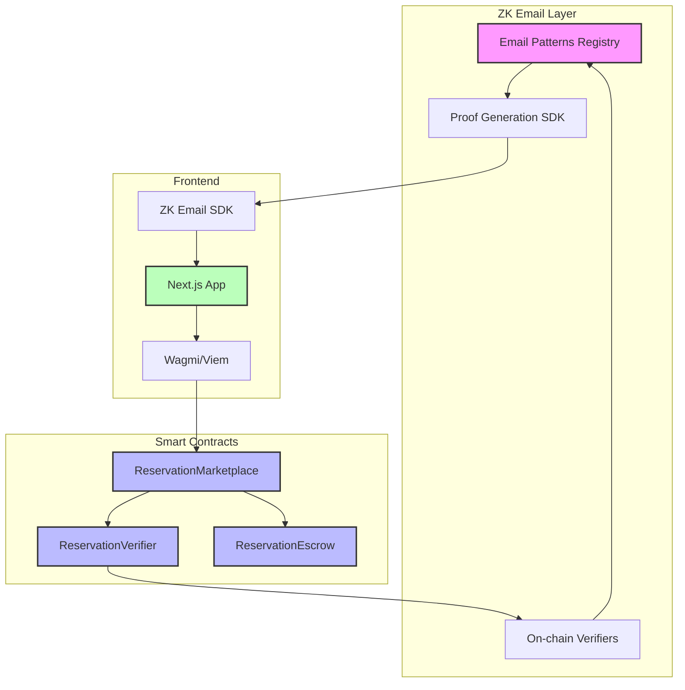
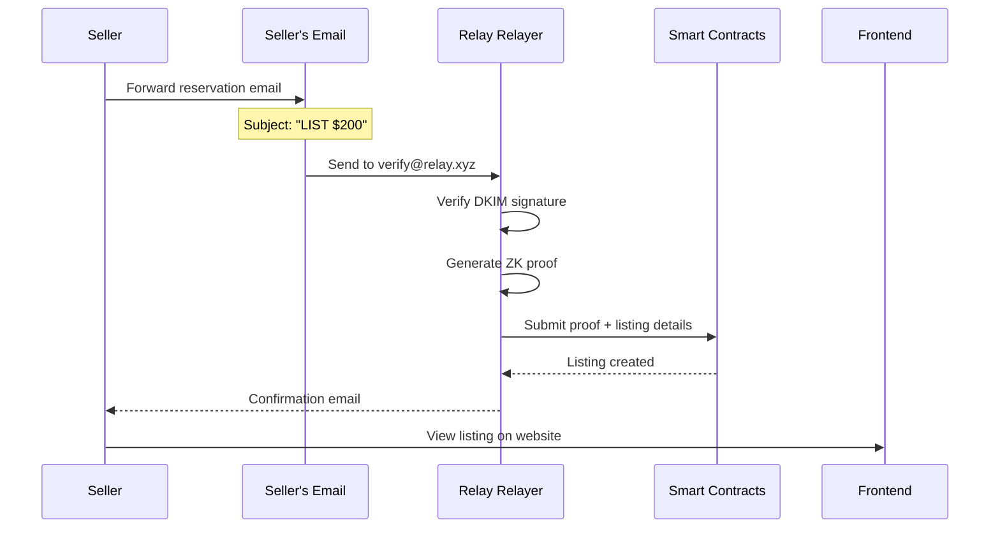
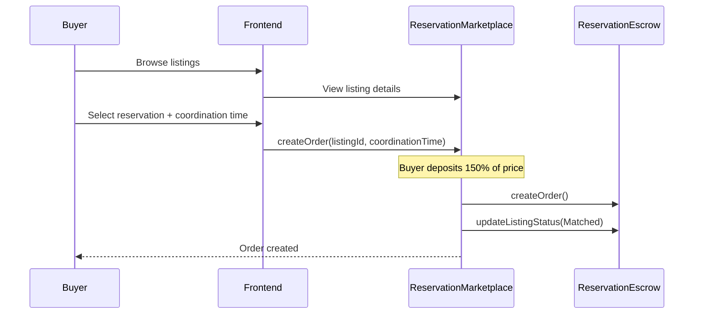
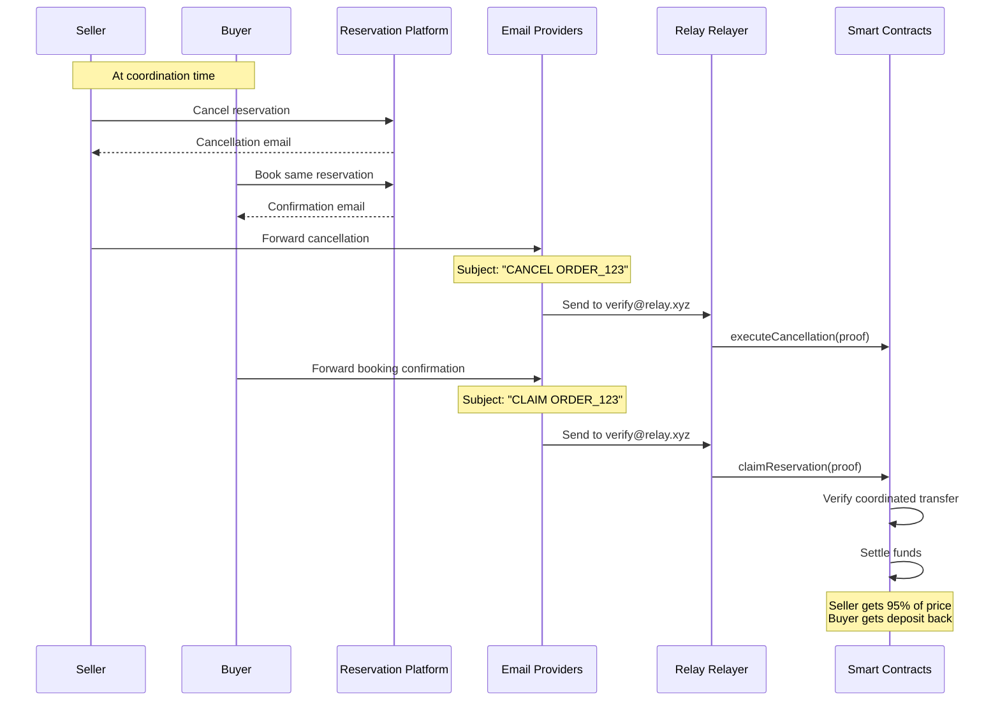
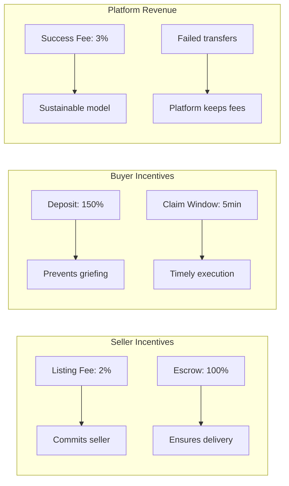

# Relay Protocol Overview

## Introduction

Relay is a decentralized marketplace for trading restaurant reservations using zero-knowledge proofs to verify ownership while maintaining privacy. The protocol combines ZK Email verification with a sophisticated escrow system to enable trustless transfers.

## Core Components

### 1. ZK Email Verification
- Proves ownership of reservation confirmation emails
- Verifies cancellation and rebooking without revealing personal data
- Uses DKIM signatures to prevent forgery

### 2. Escrow System
- Sellers lock funds as guarantee
- Buyers deposit 150% of price as collateral
- Timed coordination ensures atomic transfers

### 3. Smart Contract Architecture

## How It Works

### Step 1: Listing a Reservation

### Step 2: Creating an Order

### Step 3: Coordinated Transfer

## Security Model

### Economic Incentives

### Trust Assumptions

1. **Email Authenticity**: DKIM signatures cannot be forged
2. **Timing Precision**: 30-second window for coordinated cancellation
3. **Platform Behavior**: Reservation platforms process requests in order
4. **ZK Proof Validity**: Circom circuits correctly verify email contents

## Fee Structure

| Fee Type | Amount | Recipient | When Charged |
|----------|---------|-----------|--------------|
| Listing Fee | 2% of price | Platform | On listing creation |
| Success Fee | 3% of price | Platform | On successful transfer |
| Seller Escrow | 100% of price | Locked | During listing |
| Buyer Deposit | 150% of price | Locked | On order creation |

## Failure Scenarios

### 1. Seller Doesn't Cancel
- Buyer's deposit is returned
- Seller keeps reservation
- Platform keeps listing fee

### 2. Buyer Doesn't Claim
- Seller's escrow is returned
- Buyer loses deposit
- Platform keeps fees

### 3. Reservation Gets Sniped
- Both parties get refunds
- Platform keeps base fees
- Reputation system tracks reliability

## Privacy Features

- **Zero-Knowledge Proofs**: Only necessary reservation details are revealed
- **No PII Storage**: Personal information never touches the blockchain
- **Encrypted Communication**: Optional encrypted messaging between parties
- **Minimal On-chain Data**: Only hashes and proof results stored

## Conclusion

Relay creates a trustless marketplace for high-value restaurant reservations by combining:
- ZK Email proofs for ownership verification
- Economic incentives for good behavior
- Atomic coordination mechanisms
- Privacy-preserving architecture

This enables a liquid secondary market while protecting user privacy and preventing fraud. 