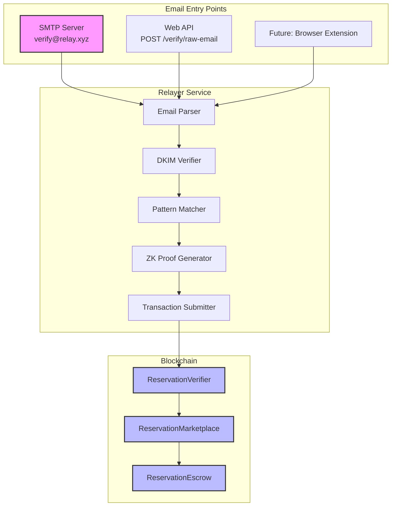
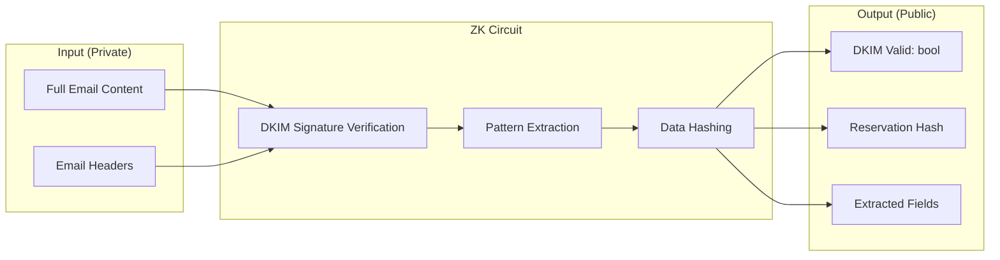
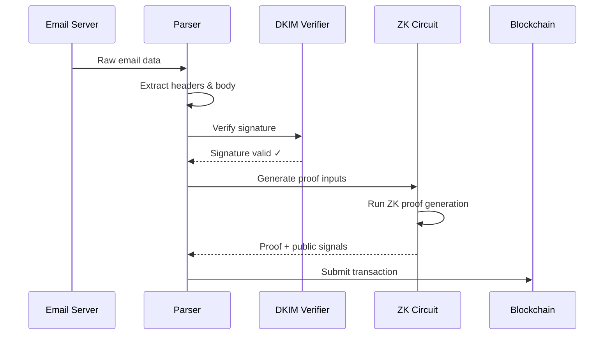
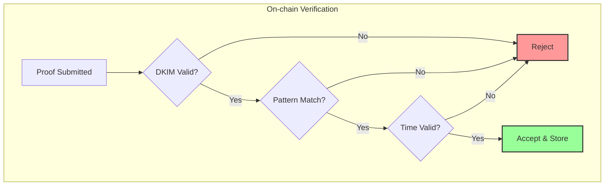

# Technical Architecture

## System Components

### 1. Email Relayer Infrastructure



### 2. ZK Email Pattern Registry

Each platform requires specific regex patterns to extract reservation data:

#### OpenTable Pattern
```typescript
{
  sender_domain: "opentable.com",
  patterns: {
    reservationId: /Reservation #([A-Z0-9]{8,12})/,
    restaurant: /at ([^\n]+) on/,
    dateTime: /on ([A-Za-z]+, [A-Za-z]+ \d{1,2}, \d{4}) at (\d{1,2}:\d{2} [AP]M)/,
    partySize: /for (\d+) guest/
  }
}
```

#### Resy Pattern
```typescript
{
  sender_domain: "resy.com",
  patterns: {
    reservationId: /Reservation: ([A-Z0-9-]{10,15})/,
    restaurant: /You're confirmed at ([^\n]+)/,
    dateTime: /(\w+, \w+ \d{1,2}) at (\d{1,2}:\d{2}(?:am|pm|AM|PM))/,
    partySize: /Party of (\d+)/
  }
}
```

### 3. ZK Circuit Architecture



### 4. Smart Contract Integration

```solidity
// Pattern verifier interface
interface IEmailPatternVerifier {
    function verifyEmailProof(
        bytes32 emailHash,
        uint256[8] calldata proof,
        string calldata platform
    ) external view returns (
        bool valid,
        bytes memory extractedData
    );
}

// Extracted data structure
struct ExtractedReservationData {
    string reservationId;
    string restaurantName;
    uint256 timestamp;
    uint8 partySize;
    bytes32 emailDomainHash;
}
```

## Data Flow

### 1. Email Receipt → Proof Generation



### 2. Proof Verification Flow



## Security Architecture

### 1. DKIM Security
- Verifies email authenticity
- Prevents email spoofing
- Cryptographically secure

### 2. ZK Proof Security
- Hides sender identity
- Proves data without revealing source
- Non-forgeable proofs

### 3. Time-based Security
```solidity
// Prevent replay attacks
require(emailTimestamp > block.timestamp - 30 days, "Email too old");
require(emailTimestamp < block.timestamp + 1 hours, "Email from future");

// Coordination window
require(cancellationTime >= coordinationTime - 30 seconds, "Too early");
require(cancellationTime <= coordinationTime + 30 seconds, "Too late");
```

## Relayer Implementation

### 1. Email Processing Pipeline

```typescript
class EmailRelayer {
  async processEmail(rawEmail: string, command: string) {
    // 1. Parse email
    const parsed = await parseEmail(rawEmail);
    
    // 2. Verify DKIM
    const dkimValid = await verifyDKIM(parsed);
    if (!dkimValid) throw new Error("Invalid DKIM");
    
    // 3. Extract platform
    const platform = detectPlatform(parsed.from);
    
    // 4. Match patterns
    const data = extractReservationData(parsed, platform);
    
    // 5. Generate proof
    const proof = await generateZKProof(parsed, data);
    
    // 6. Submit to chain
    const tx = await submitToBlockchain(proof, command);
    
    return tx;
  }
}
```

### 2. Command Processing

```typescript
enum EmailCommand {
  LIST = "LIST",      // List new reservation
  CANCEL = "CANCEL",  // Execute cancellation
  CLAIM = "CLAIM"     // Claim new booking
}

function parseSubject(subject: string): {
  command: EmailCommand,
  params: string[]
} {
  const match = subject.match(/^(LIST|CANCEL|CLAIM)\s*(.*)$/);
  if (!match) throw new Error("Invalid command");
  
  return {
    command: match[1] as EmailCommand,
    params: match[2].split(/\s+/)
  };
}
```

## Scalability Considerations

### 1. Proof Generation
- Off-chain proof generation
- Parallel processing capability
- Caching for repeated patterns

### 2. Gas Optimization
- Batch proof verification
- Minimal on-chain storage
- Efficient data structures

### 3. Relayer Decentralization
- Anyone can run a relayer
- Proof generation is permissionless
- Multiple relayers increase reliability

## Future Enhancements

### 1. Additional Platforms
- Tock integration
- Yelp Reservations
- International platforms

### 2. Advanced Features
- Multi-reservation bundles
- Automated trading bots
- Reputation system

### 3. Privacy Improvements
- Stealth addresses
- Private order matching
- Encrypted metadata 