# Relay: The Vision & User Experience

## What is Relay?

Relay is a marketplace where people can safely buy and sell restaurant reservations. Think of it like StubHub, but for dinner reservations at popular restaurants.

## The Problem We Solve

**Have you ever...**
- 🎂 Needed a last-minute reservation for a special occasion?
- 😔 Made a reservation months ago but can't use it anymore?
- 🍽️ Wanted to try that impossible-to-book restaurant?
- 💸 Wished you could recoup costs when plans change?

Popular restaurants book up months in advance. When plans change, those valuable reservations often go to waste. Meanwhile, others desperately search for availability.

**Relay connects these people.**

## How It Works (Simple Version)

### For Sellers: Turn Cancelled Plans into Cash

1. **List Your Reservation** 
   - Forward your confirmation email to us
   - Set your price
   - We handle everything else

2. **Get Matched**
   - Buyers browse and purchase your listing
   - You coordinate a quick handoff

3. **Get Paid**
   - Cancel your reservation
   - Buyer immediately books it
   - Money automatically transfers to you

### For Buyers: Get the Reservation You Want

1. **Browse Available Tables**
   - See real reservations from real people
   - Filter by date, time, party size
   - Transparent pricing

2. **Purchase Securely**
   - Place a refundable deposit
   - Coordinate timing with seller
   - Protected by smart contracts

3. **Claim Your Table**
   - Seller cancels at agreed time
   - You book immediately after
   - Enjoy your dinner!

## The Magic: How We Keep It Safe

### 🔐 **Zero-Knowledge Proofs**
We verify reservations are real without exposing anyone's personal information. Your email stays private.

### 💰 **Smart Escrow**
Money is held securely until the transfer completes. Both parties are protected.

### ⏱️ **Perfect Timing**
Our system coordinates the cancel-and-rebook dance down to the second.

```mermaid
sequenceDiagram
    participant S as Seller
    participant R as Relay System
    participant B as Buyer
    participant OT as OpenTable
    
    Note over S,B: 7:00:00 PM - Coordination Time
    S->>OT: Cancel reservation
    OT-->>S: ✓ Cancelled
    Note over S,B: 7:00:15 PM
    B->>OT: Book same table
    OT-->>B: ✓ Confirmed
    Note over S,B: 7:00:30 PM
    R->>S: Transfer $285
    R->>B: Return $150 deposit
    Note over S,B: Success! 🎉
```

### 🛡️ **Bad Actor Protection**
Deposits and fees make scamming unprofitable. Good behavior is rewarded.

## User Experience Walkthrough

### Sarah Wants to Sell

Sarah booked Carbone for her anniversary 3 months ago. Her partner just got called away on business. Instead of canceling for nothing:

**📧 Step 1:** She forwards her OpenTable confirmation to `list@relay.xyz`  
**💰 Step 2:** Adds "LIST $300" to the subject line  
**🔗 Step 3:** Gets a link to track her listing  
**📱 Step 4:** When someone buys, she gets a text: "Ready to transfer at 7:00 PM"  
**❌ Step 5:** At exactly 7:00 PM, she cancels through OpenTable  
**✅ Step 6:** 30 seconds later, $285 hits her wallet (she keeps 95%)

> **⏱️ Time invested:** 2 minutes  
> **💵 Money earned:** $285

### James Wants to Buy

James forgot his girlfriend's birthday is tomorrow. Every good restaurant is booked. He opens Relay:

**🔍 Step 1:** Searches "Saturday, 2 people, 7-9 PM"  
**📋 Step 2:** Sees 5 available reservations with prices  
**✨ Step 3:** Picks Carbone for $300 - perfect!  
**💳 Step 4:** Pays $450 deposit (he gets $150 back after success)  
**⏰ Step 5:** At 7:00 PM, gets an alert: "Ready to book!"  
**📱 Step 6:** Opens OpenTable, books the exact reservation  
**💚 Step 7:** Gets his deposit back minus the $300 price

> **⏱️ Time invested:** 5 minutes  
> **🎉 Special night:** Saved

## Why It's Different

### Not Like Other Marketplaces

| Traditional Resale | Relay |
|-------------------|--------|
| Trust random strangers | Trust code and math |
| "Send money first, hope for the best" | Escrow protects both sides |
| Share personal details | Stay completely anonymous |
| Complex coordination | Automated handoff |
| Risk of scams | Economically secured |

### Not Like Scalping
- **No bots** - Only real reservations from real people
- **No hoarding** - Must have existing confirmation
- **Fair prices** - Market-driven, not inflated
- **Helps restaurants** - Fills tables that would go empty

## The Bigger Vision

### Today: Premium Restaurants
Starting with high-demand restaurants where reservations have real value.

### Tomorrow: Any Reservation
- 🎭 Theater tickets
- 💇 Salon appointments  
- 🏌️ Tee times
- 🎾 Court reservations
- 🏥 Specialist appointments

### The Future: Liquid Calendar
Imagine if any commitment on your calendar could be:
- Transferred when plans change
- Monetized if valuable
- Swapped for better options
- All with one click

## Design Principles

### 1. Invisible Complexity
Users don't need to understand blockchain, ZK proofs, or smart contracts. It just works.

### 2. Familiar Patterns
Feels like eBay or StubHub - marketplaces people already understand.

### 3. Mobile First
Most reservations are managed on phones. Our UX reflects this.

### 4. Trust Through Transparency
- See seller ratings
- Track transfer success rates
- Clear pricing
- No hidden fees

## Join the Revolution

Stop letting valuable reservations go to waste. Start making your calendar work for you.

**For Restaurants**: Happy customers, full tables, no involvement needed.

**For Diners**: Flexibility, opportunity, and access to the inaccessible.

**For Everyone**: A more efficient world where value flows to those who need it most.

---

*Relay: Because great tables shouldn't go to waste.* 